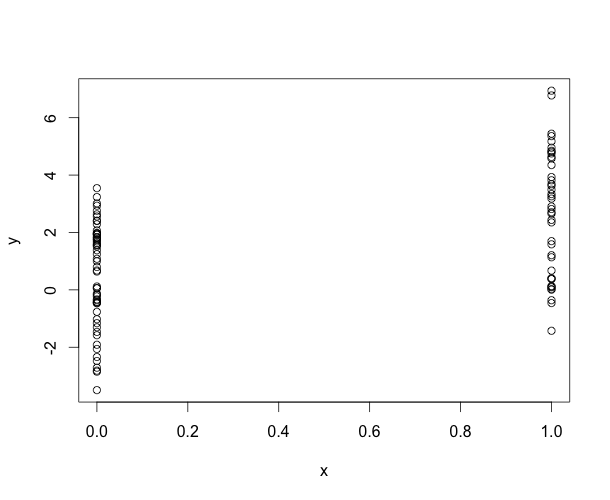
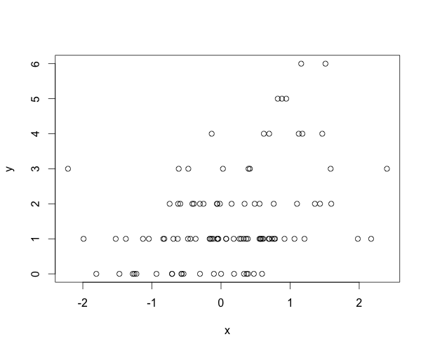

### Simulating a Linear Model
Suppose we want to simulate from the following linear model

<p style='text-align: center;'>y = $\beta_0$ + $\beta_1 x$ + $\varepsilon$</p>

where $\varepsilon\sim\mathcal{N}(0, 2^2)$. Assume $x\sim\mathcal{N}(0,1^2)$, $\beta_0 = 0.5$ and $\beta_1 = 2$.

```
> set.seed(20)
> x <- rnorm(100)
> e <- rnorm(100, 0, 2)
> y <- 0.5 + 2 * x + e
> summary(y)
   Min. 1st Qu.  Median    Mean 3rd Qu.    Max. 
-6.4080 -1.5400  0.6789  0.6893  2.9300  6.5050 
> plot(x, y)
```


---


What if `x` is binary?

```
> set.seed(10)
> x <- rbinom(100, 1, 0.5)
> e <- rnorm(100, 0, 2)
> y <- 0.5 + 2 * x + e
> summary(y)
   Min. 1st Qu.  Median    Mean 3rd Qu.    Max. 
-3.4940 -0.1409  1.5770  1.4320  2.8400  6.9410 
> plot(x, y)
```



---

##### Generating Random Numbers From a Generalized Linear Model
Suppose we want to simulate from a Poisson model where

Y ~ Poisson(μ)

log μ = $\beta_0 + \beta_1x$

and $\beta_0 = 0.5$ and $\beta_1 = 0.3$. We need to use the `rpois` function for this

```
> set.seed(1)
> x <- rnorm(100)
> log.mu <- 0.5 + 0.3 * x
> y <- rpois(100, exp(log.mu))
> summary(y)
   Min. 1st Qu.  Median    Mean 3rd Qu.    Max. 
   0.00    1.00    1.00    1.55    2.00    6.00 
> plot(x, y)
```


  
  

  
